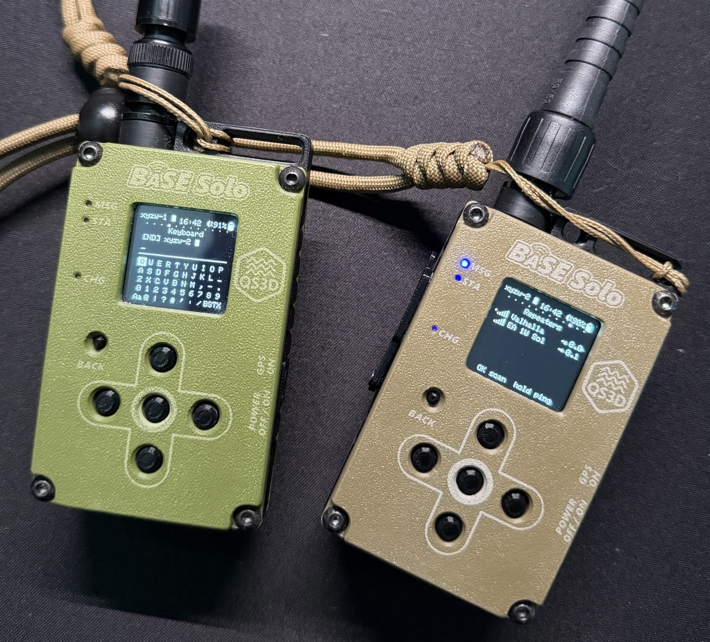

# MeshCore v1.16.0 - MuninnCore patch for MuziWorks Base Duo + Super IO

<p align="center">
  
</p>

## Custom features added
- Board targets for Base Duo, Base Uno, and Super IO.
- LR1121 support for Base Duo.
- SX1262 support for Base Uno.
- BLE and USB companion builds.
- UF2 and Adafruit DFU ZIP release artifacts.
- QSPI/LittleFS contact storage.
- Smart GPS with delayed start, motion wake, idle sleep, and saved last fix.
- ICM-20948 compass with guided calibration and antenna alignment.
- SH1107 UI for chats, DMs, quick send, GPS, compass, sensors, and repeater scan.
- RTC detection, GPS time sync, buzzer, LEDs, diagnostics, and LiPo battery curve.
- Power modes: Normal, Expedition, Stationary.

## References
- **MeshCore PRs:** [meshcore-dev/MeshCore#2198](https://github.com/meshcore-dev/MeshCore/pull/2198) (Base Duo board support), [#2054](https://github.com/meshcore-dev/MeshCore/pull/2054) (Muzi Base Duo), [#1303](https://github.com/meshcore-dev/MeshCore/pull/1303) (runtime display-orientation flip).
- **Meshtastic PRs:** [meshtastic/firmware#8753](https://github.com/meshtastic/firmware/pull/8753) (Muzi Base support), [#8870](https://github.com/meshtastic/firmware/pull/8870) (Muzi buzzer behavior), [#8925](https://github.com/meshtastic/firmware/pull/8925) (Muzi LED notification).
- **Other references:** [RadioLib](https://github.com/jgromes/RadioLib) (LR1121 / SX126x drivers), [meshtastic/meshtastic#2237](https://github.com/meshtastic/meshtastic/pull/2237) (Muzi BASE System docs).

## Build / flash
```sh
pio run -e muziworks_duo_super_io_companion_radio_ble -t upload
```
Variants: `muziworks_duo` / `muziworks_uno`, optional `_super_io`, with `companion_radio_ble` / `_usb`, `repeater`, or `room_server`.
